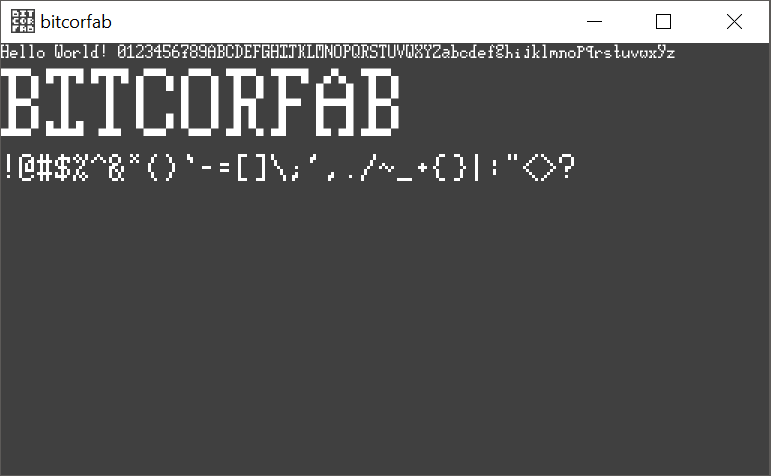

## 20171125 - Text Scrolling and Clipping

Got scrolling text and clipping working.
Seems to work well with the table now.
It also sizes correctly.

## 20171018 - Font Text Works

The font drawing seems to be working great!
And scene2d.ui seems to be doing what I want it to. That's a plus.
Now for some other tiles and stuff.